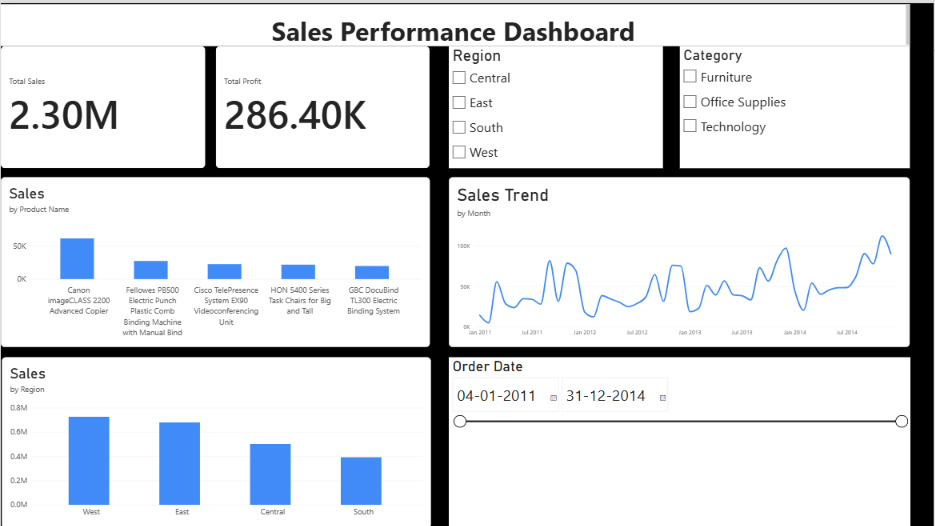

# Business Sales Performance Dashboard

## Overview

This project presents a Business Sales Performance Dashboard built using Microsoft Excel and Power BI. The dashboard analyzes sales and profit performance across products, regions, categories, and time periods.

## Tools Used

- Microsoft Excel
- Power BI Desktop
- Power Query
- Data Visualization

## Dashboard Features

- Total Sales KPI
- Total Profit KPI
- Sales by Product
- Monthly Sales Trend
- Sales by Region
- Region filter
- Category filter
- Order Date range filter

## Key Metrics

| Metric | Value |
|---|---:|
| Total Sales | 2.30M |
| Total Profit | 286.40K |

## Dashboard Preview



## Project Structure

```text
business-sales-performance-dashboard/
│
├── data/
│   └── Business_Sales_Performance.xlsx
│
├── powerbi/
│   └── Sales_Performance_Dashboard.pbix
│
├── report/
│   └── Task_1_Insights_Recommendations.pdf
│
├── screenshots/
│   └── dashboard.png
│
└── README.md
